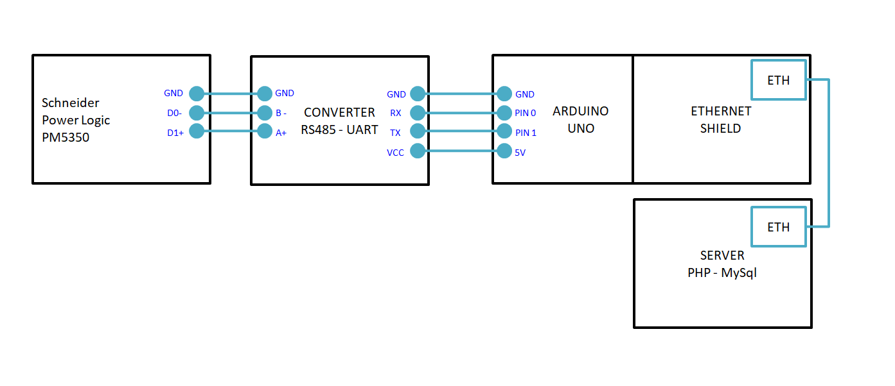

# Arduino-Schneider-Power-Logic-PM5350

Share a project to record the Schneider-Power-Logic-PM5350 data to database (MySql).

## Video
All video in indonesian language.
#### Video 01 : Communication and wiring

> code in video01 can be found in folder code_arduino_video01 
> 
#### Video 02 : Application Demo

#### Video 03 : Installation guide

#### Video 04 : Menampilkan pembacaan PM5350 ke web via wifi dengan ESP32 

## Hardware required
- Schneider-Power-Logic-PM5350
- Server (PHP & MySQL)
- Arduino UNO
- Ethernet shield for arduino UNO
- Converter RS484 to UART

## Communication
- Schneider-Power-Logic-PM5350 to arduino using modbus RTU (via RS485)
- Arduino to server using http request (via ethernet cable)
> Check video 01 for detail   

## Wiring

>  Check video 01 & 02 for detail   

## License and credits
My code under MIT license, other libraries follow their own license.
- SimpleModbusMaster.h https://github.com/angeloc/simplemodbusng
- jQuery.js https://jquery.org/license/
- Bootstrap https://getbootstrap.com/
- etc...

## Donation  
Support me  
- [Send me coffee](https://sociabuzz.com/fahroniganteng/tribe)
- [or maybe ice cream](https://trakteer.id/fahroniganteng/tip) 
