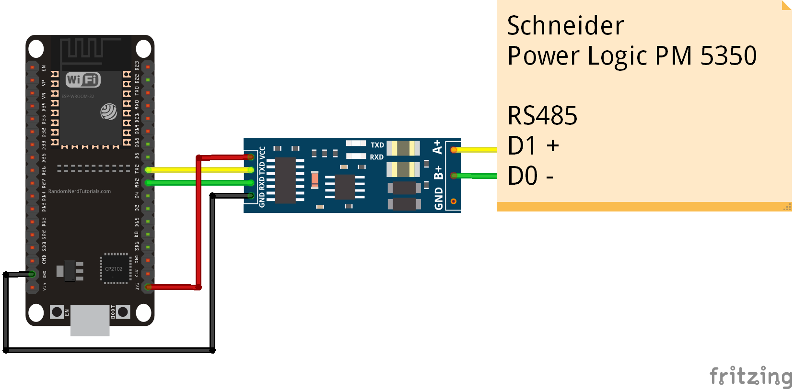

# ESP32-Schneider-Power-Logic-PM5350
Menampilkan Kwh schneider power logic PM5350 ke web via wifi dengan ESP32 - modbus RTU - RS485

## Video

## wiring

## Lisensi
Kode saya gratis dibawah lisensi MIT, untuk library pendukung lain mengikuti linsensi masing-masing.

## Dukung saya 
- [Traktir kopi](https://sociabuzz.com/fahroniganteng/tribe)
- [atau Es krim](https://trakteer.id/fahroniganteng/tip) 
